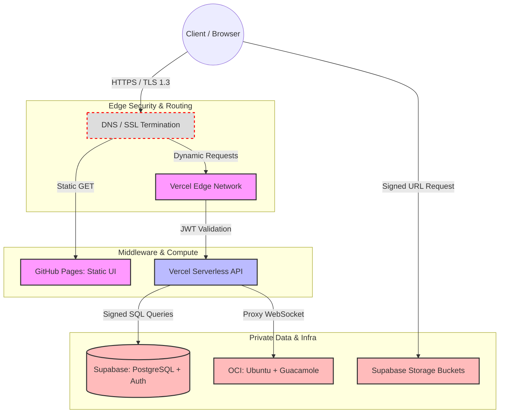

# Technical Requirements Document (TRD)
**Project Name:** Azathoth 
**Document Owner:**  Admin / Developer
**Status:** Draft v1.0

## 1. System Architecture Overview
The Azathoth platform employs a decoupled, serverless-first architecture designed for high availability, zero-maintenance scaling, and strict perimeter security. It leverages edge hosting for static assets, serverless functions for middleware logic, a managed PostgreSQL instance for relational state, and an isolated cloud environment for remote administration.

## 2. Network Flow & Security Boundaries

'''
## 3. Technology Stack & Architectural Decisions

Every component in the stack was selected by weighing performance, maintenance overhead, and security against viable alternatives.

| **Layer**            | **Chosen Technology**         | **Alternatives Rejected**             | **Justification for Choice**                                                                                                                                                    |
| -------------------- | ----------------------------- | ------------------------------------- | ------------------------------------------------------------------------------------------------------------------------------------------------------------------------------- |
| **Frontend Hosting** | **GitHub Pages**              | AWS S3, Netlify                       | Native integration with the repository. Provides free, high-availability static hosting with zero configuration required.                                                       |
| **App / API Logic**  | **Vercel**                    | AWS API Gateway + Lambda, Heroku      | Superior developer experience for serverless deployment. Handles dynamic routing and middleware edge-caching more efficiently than raw AWS Lambda setups.                       |
| **Database**         | **PostgreSQL (via Supabase)** | MongoDB, Firebase (NoSQL)             | The forum and RBAC systems require complex relational mapping. PostgreSQL provides strict schema enforcement and native Row Level Security (RLS) which NoSQL alternatives lack. |
| **Authentication**   | **Supabase Auth (GoTrue)**    | Auth0, Custom JWT logic               | Natively tied to the PostgreSQL database. Allows DB-level rejection of queries if the JWT token is invalid, eliminating a massive middleware attack vector.                     |
| **Object Storage**   | **Supabase Storage**          | AWS S3                                | Keeps infrastructure centralized. Integrates directly with the same auth tokens used for the database, simplifying permission management for the Vault.                         |
| **Remote Gateway**   | **Apache Guacamole**          | Chrome Remote Desktop, Direct SSH/RDP | Provides clientless HTML5 access. Prevents exposing vulnerable ports (22, 3389) to the public internet.                                                                         |
| **Remote Server**    | **Oracle Cloud (OCI) Ubuntu** | AWS EC2, DigitalOcean                 | OCI provides a robust "Always Free" tier (ARM instances) that includes sufficient compute and bandwidth for a personal development server.                                      |

## 4. Security Architecture

Security is enforced at three distinct layers: the Edge, the Application, and the Database.

### 4.1. Data in Transit & Perimeter Defense

- All traffic is strictly enforced over **TLS 1.3**. Unencrypted HTTP requests are automatically upgraded or dropped at the DNS level.
    
- Static assets are served via CDN, mitigating basic DDoS vectors by caching content at the edge.

### 4.2. Access Control & Identity (JWT)

- The system utilizes stateless JSON Web Tokens (JWT) for authentication.
    
- Session tokens are stored in secure, `HttpOnly`, `SameSite=Strict` cookies to prevent Cross-Site Scripting (XSS) payload extraction.
    
- Vercel edge middleware intercepts all requests to `/shared-vault` and `/admin-dashboard` to verify the JWT signature before invoking any compute resources.

### 4.3. Data at Rest & Row Level Security (RLS)

- Storage buckets and database volumes are encrypted at rest using AES-256.
    
- **Row Level Security (RLS):** This is the ultimate fallback. Even if a malicious actor bypasses the Vercel API and attempts to query the database directly, the PostgreSQL engine executes the query against the user's JWT `role_id`. If an "Associate" tries to read an "Admin" file, the database drops the request at the kernel level.
    
- The OCI instance firewall (Security Lists) is configured to drop all incoming TCP connections except those originating from the Vercel Guacamole proxy, completely hiding the server from public IP scanners.

### 4.4. Distributed Denial of Service (DDoS) Mitigation
To protect against both volumetric (Layer 3/4) and application-layer (Layer 7) attacks, mitigation strategies are enforced across all three infrastructure providers.

* **Edge/API Layer (Vercel & GitHub Pages):** * Vercel's Edge Network automatically absorbs volumetric attacks (UDP reflection, SYN floods) and drops malicious packets before they reach the serverless functions.
  * **Rate Limiting:** Vercel middleware enforces strict rate limiting on all `POST` requests (e.g., the Contact Form and Authentication routes) to prevent Layer 7 HTTP flood attacks and credential stuffing.
* **Database Layer (Supabase):**
  * Direct public connection to the PostgreSQL port (5432) is disabled.
  * Connection exhaustion attacks are mitigated using Supabase's built-in connection pooler (Supavisor), which queues and manages active connections rather than allowing concurrent floods to crash the database engine.
  * Statement timeouts are enforced to kill maliciously slow queries designed to lock up database resources.
* **Infrastructure Layer (OCI & Guacamole):**
  * The Oracle Cloud Virtual Cloud Network (VCN) Security Lists are configured to silently drop all external ICMP (Ping) requests and block all inbound TCP/UDP traffic.
  * The only allowed ingress traffic is restricted to the specific IP ranges of the Vercel deployment, making the Guacamole server completely "dark" to public internet scanners and botnets.

## 5. Database Schema & Data Architecture

The database is built on PostgreSQL. To guarantee atomicity and handle bulk data efficiently, the schema strictly avoids JSONB blobs for relational data, enforces foreign key constraints to prevent orphaned records, and utilizes B-Tree indexing on all query-heavy columns.

### 5.1. Core Tables & Normalization

#### Table: `profiles`
Maps to the hidden Supabase `auth.users` system table. Stores public and RBAC data.
| Column | Type | Constraints | Description |
| :--- | :--- | :--- | :--- |
| `id` | `uuid` | PK, FK (`auth.users.id`) CASCADE | Primary identifier. |
| `role` | `varchar(20)` | NOT NULL, DEFAULT 'public' | Enforces RBAC (`public`, `associate`, `admin`). |
| `display_name` | `varchar(50)` | NOT NULL | Publicly visible name for forum posts. |
| `created_at` | `timestamptz` | NOT NULL, DEFAULT `now()` | Timezone-aware creation timestamp. |

#### Table: `forum_posts`
Stores all community discussions. Normalized to ensure rapid bulk querying without duplicating user data.
| Column | Type | Constraints | Description |
| :--- | :--- | :--- | :--- |
| `id` | `uuid` | PK, DEFAULT `uuid_generate_v4()` | Unique post identifier. |
| `author_id` | `uuid` | FK (`profiles.id`) SET NULL | Links post to author. Becomes NULL if user deleted. |
| `title` | `varchar(150)` | NOT NULL | Post header. |
| `body` | `text` | NOT NULL | Sanitized Markdown/text payload. |
| `is_archived` | `boolean` | DEFAULT `false` | Soft-delete flag. Preserves data atomicity. |
| `created_at` | `timestamptz`| NOT NULL, DEFAULT `now()` | Timestamp of post. |

*Index Strategy:* B-Tree index on `created_at` (DESC) and `author_id` to handle bulk loading on the forum frontend.

#### Table: `vault_metadata`
Stores metadata for files hosted in Supabase Storage. Separating metadata from physical storage ensures the database remains highly performant during bulk file operations.
| Column | Type | Constraints | Description |
| :--- | :--- | :--- | :--- |
| `id` | `uuid` | PK, DEFAULT `uuid_generate_v4()` | Unique file identifier. |
| `storage_path` | `text` | NOT NULL, UNIQUE | Exact path in the Supabase Storage bucket. |
| `file_name` | `varchar(255)` | NOT NULL | Human-readable name. |
| `access_tier`| `varchar(20)` | NOT NULL | Defines who can read it (`associate`, `admin`). |
| `size_bytes` | `bigint` | NOT NULL | Used for storage quota calculations. |

#### Table: `audit_logs`
An append-only ledger tracking all authentication and data-modification events. Crucial for system governance.
| Column | Type | Constraints | Description |
| :--- | :--- | :--- | :--- |
| `log_id` | `bigserial` | PK | Sequential integer for rapid bulk inserts. |
| `actor_id` | `uuid` | FK (`profiles.id`) | Who triggered the event (can be null for system). |
| `action` | `varchar(50)` | NOT NULL | e.g., `LOGIN_FAILED`, `FILE_DELETED`, `POST_CREATED`. |
| `ip_address` | `inet` | NULL | IPv4/IPv6 address of the actor. |
| `timestamp` | `timestamptz`| NOT NULL, DEFAULT `now()` | Exact time of the event. |

*Edge Case Mitigation:* If the system generates millions of logs, this table will be partitioned by month (`PARTITION BY RANGE (timestamp)`) to maintain query speed and allow for bulk archival of old logs.

### 5.2. Row Level Security (RLS) Policies

To prevent unauthorized bulk scraping or data manipulation, security is enforced at the database kernel level using RLS. Even if an API endpoint is compromised, the database will reject the query.

* **`profiles` Table:**
  * *Read:* `TRUE` (Everyone can read display names for the forum).
  * *Update:* `auth.uid() = id` (Users can only update their own display name) OR `auth.jwt() ->> 'role' = 'admin'`.
* **`forum_posts` Table:**
  * *Read:* `is_archived = false` (Public can read active posts).
  * *Insert:* `auth.uid() IS NOT NULL` (Must be authenticated).
  * *Update/Delete:* `auth.uid() = author_id` OR `auth.jwt() ->> 'role' = 'admin'`.
* **`vault_metadata` & Storage Buckets:**
  * *Read (Associates):* `auth.jwt() ->> 'role' IN ('associate', 'admin') AND access_tier = 'associate'`.
  * *Read (Admin):* `auth.jwt() ->> 'role' = 'admin'`.
  * *Write/Delete:* `auth.jwt() ->> 'role' = 'admin'` (Only Admin can modify the vault).
* **`audit_logs` Table:**
  * *Read:* `auth.jwt() ->> 'role' = 'admin'` (Strictly Admin only).
  * *Insert:* Executed via PostgreSQL Triggers with `SECURITY DEFINER` privileges. Users cannot manually insert or modify logs.
  * *Update/Delete:* `FALSE` (Immutable table).

### 5.3. Edge Case Handling & Data Integrity
1. **Orphaned Data:** If a user account is deleted, their `forum_posts` are retained but `author_id` is set to `NULL` (via `ON DELETE SET NULL`), preserving the community thread context without violating foreign key constraints. 
2. **Concurrent Bulk Writes:** The system uses transaction blocks (`BEGIN` ... `COMMIT`) when handling multi-table operations (e.g., uploading a file to storage AND writing to `vault_metadata`). If the storage upload fails, the database write automatically rolls back, maintaining perfect atomicity.
3. **Pagination & Load Limits:** All `SELECT` queries against `forum_posts` and `audit_logs` are strictly paginated using `LIMIT` and `OFFSET` to prevent Out Of Memory (OOM) errors during bulk retrieval.

### 5.4. Threat Mitigation & Database Defense

To maintain strict governance and protect against common web vulnerabilities (OWASP Top 10), the database and API layers enforce the following defensive protocols:

* **SQL Injection (SQLi) Prevention:** The system utilizes PostgREST for all database interactions. All API requests are automatically translated into parameterized queries (prepared statements). User input is never concatenated directly into executable SQL strings, rendering standard injection attacks mathematically impossible at the application layer.
* **Insecure Direct Object Reference (IDOR) Prevention:** Resource IDs (UUIDs) are decoupled from access rights. Row Level Security (RLS) acts as a strict gatekeeper. Even if an attacker discovers the UUID of a restricted `vault_metadata` record, the PostgreSQL kernel will return a `404 Not Found` equivalent if the requester's JWT `role` does not match the required `access_tier`.
* **Cross-Site Scripting (XSS) Mitigation:** All inputs targeting the `forum_posts` and `inquiries` tables undergo strict server-side sanitization to strip executable `<script>` tags and malicious HTML attributes before the `INSERT` transaction is committed.
* **Cross-Site Request Forgery (CSRF) Mitigation:** Authentication state is managed via secure, `HttpOnly` cookies strictly bound to the `adarshsadanand.in` domain utilizing the `SameSite=Strict` attribute, preventing unauthorized cross-origin requests from utilizing an active session.

### 5.5. Availability, Maintenance & GRC Protocols

To ensure continuous operation and compliance with standard data privacy frameworks, the database layer enforces strict lifecycle and availability controls.

* **High Availability & Disaster Recovery (DR):** The PostgreSQL database utilizes Write-Ahead Logging (WAL) to enable Point-in-Time Recovery (PITR). Automated physical backups are executed daily by the infrastructure provider, ensuring a strict Recovery Point Objective (RPO) of 24 hours in the event of catastrophic data corruption.
* **Automated Log Rotation:** To prevent storage exhaustion and maintain query performance, system audit logs are subjected to automated lifecycle management. A `pg_cron` background worker executes a monthly cleanup script, archiving or permanently dropping records in the `audit_logs` table that exceed a 365-day retention period.
* **PII Sanitization & The Right to be Forgotten (RTBF):** The schema is designed to respect user privacy while maintaining referential integrity. When an authenticated Associate requests account deletion, a cascading database function is triggered. This function permanently purges the user's Personally Identifiable Information (PII) from the `profiles` table. Associated relational records, such as `forum_posts`, are retained to preserve community thread context, but their `author_id` is irreversibly nullified, rendering the data fully anonymized.