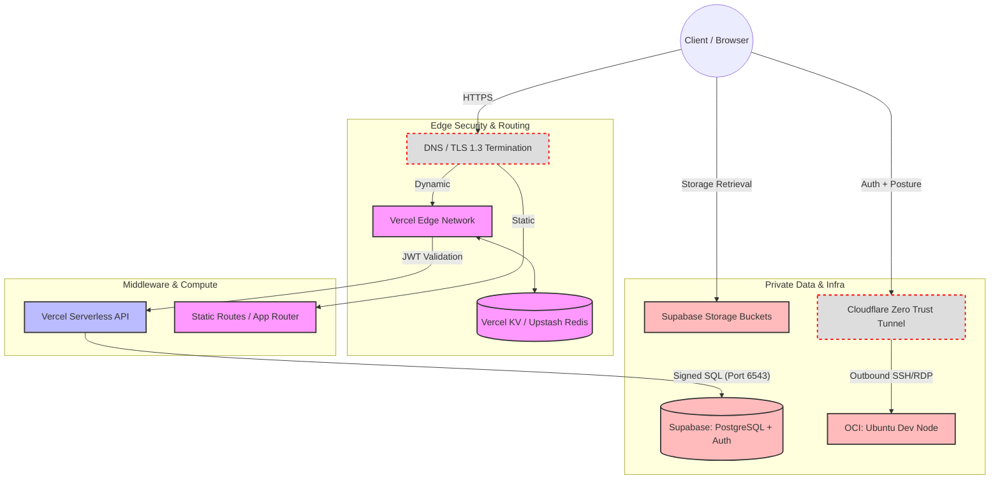

# Technical Requirements Document (TRD)
**Project:** Azathoth (adarshsadanand.in)  
**Version:** v3.2 (Production-Ready, Constraint-Aware, Hardened with Trap Mitigations)  
**Status:** Architecture Baseline  
**Author:** Aditya (System Architecture / Developer)  

## 1. Architecture Overview
Azathoth is a serverless-first, edge-mediated web platform designed for a personal portfolio with a community forum, role-based shared vault, and secure remote development access. It prioritizes:

* Low operational overhead and predictable scaling within modest traffic bounds.
* Strong authorization guarantees through RLS-first design.
* Controlled mutation pathways with API-gated writes and explicit compensation logic for distributed operations.
* Strict Zero Trust and outbound-only infrastructure for remote access.
* Defense-in-depth across edge, application, and database layers, with realistic handling of distributed system constraints.

### Architectural Tenets
* **Least Privilege by Default:** Enforced primarily at the database (RLS), not just the API.
* **Client is Untrusted:** All sensitive operations undergo server-side validation and sanitization.
* **Edge as Gatekeeper:** Handles routing, coarse-grained auth checks, rate limiting, and TLS termination.
* **Database as Final Authority:** Authorization decisions occur at query execution time via PostgreSQL RLS.
* **Outbound-Only Infrastructure:** No public ingress ports to any compute or database resources.
* **Distributed Operations Require Explicit Compensation:** No true cross-service ACID transactions; use saga-like patterns or cleanup on failure.

---

## 2. System Architecture (Logical View)

### Request Flow (Deterministic)
1. **Client $\rightarrow$ Edge (Vercel CDN):**
   * TLS 1.3 termination.
   * Static asset delivery from edge cache.
   * Initial route classification and rate limiting (backed by persistent KV store).
2. **Edge Decision Point:**
   * *Public routes* $\rightarrow$ direct response.
   * *Protected routes* $\rightarrow$ JWT presence and signature validation in edge middleware.
   * *API routes* $\rightarrow$ forward to Vercel Serverless Functions.
3. **Application Layer (Vercel Serverless Functions):**
   * Schema-based input validation.
   * Business rule enforcement and server-side sanitization.
   * Controlled database mutations with auditing and compensation logic for partial failures.
4. **Data Layer (Supabase PostgreSQL + Storage):**
   * JWT verified natively.
   * RLS policies applied at the kernel level.
   * Read-heavy operations may bypass API for latency when RLS permits.
5. **Remote Access:**
   * Browser $\rightarrow$ Cloudflare Zero Trust Access $\rightarrow$ Cloudflare Tunnel $\rightarrow$ OCI Ubuntu instance.
   * No inbound ports exposed.

## 3. Traffic & Load Assumptions (Design Constraint)

|**Metric**|**Expected (Initial)**|**Upper Bound (Short Term)**|
|---|---|---|
|**Total Users**|50–500|~2,000|
|**Concurrent Users**|10–50|~200|
|**Requests/sec**|<100|~300|
|**Database Size**|<5 GB|~20 GB|

_Implications:_ No sharding, distributed caching, or queues required yet. Design remains simple and efficient.

---

## 4. Technology Stack

|**Layer**|**Technology**|**Role**|
|---|---|---|
|**Edge + Hosting**|Vercel (Next.js App Router + Edge)|CDN, routing, middleware|
|**Rate Limiting Store**|Vercel KV (or Upstash Redis)|Persistent state for edge rate limiting|
|**API Layer**|Vercel Serverless Functions|Secure execution boundary|
|**Database**|Supabase (PostgreSQL + PostgREST)|Relational data + RLS|
|**Authentication**|Supabase Auth (JWT)|JWT issuance + validation|
|**Storage**|Supabase Storage (S3-compatible)|Object storage with RLS-aligned permissions|
|**Remote Access**|Cloudflare Zero Trust + Tunnel|Secure clientless access|
|**Dev Compute**|Oracle Cloud Infrastructure (ARM)|Persistent Ubuntu dev node|

---

## 5. Trust Boundaries & Data Flow

### 5.1 Trust Zones

|**Zone**|**Trust Level**|**Notes**|
|---|---|---|
|**Client**|Untrusted|Can be fully tampered with; never trusted for authorization.|
|**Edge**|Semi-trusted|Enforces coarse controls, rate limiting, and initial JWT checks.|
|**API**|Trusted|Validates intent, sanitizes input, and orchestrates logic.|
|**Database**|Trusted (Authoritative)|Final access control via RLS and schema constraints.|
|**OCI**|Isolated|No inbound access; reachable only via outbound tunnel.|

### 5.2 Operation Routing Matrix

|**Operation**|**Path**|**Notes**|
|---|---|---|
|**Public reads**|Client $\rightarrow$ Supabase (RLS)|Direct for performance|
|**Authenticated reads**|Client $\rightarrow$ Supabase (RLS)|RLS filters rows|
|**Writes / Mutations**|Client $\rightarrow$ API $\rightarrow$ Supabase|Server-side validation + audit|
|**Admin operations**|Client $\rightarrow$ API $\rightarrow$ Supabase|Strict role + RLS|
|**Remote access**|Client $\rightarrow$ CF Zero Trust $\rightarrow$ OCI|Identity + posture checked|

---

## 6. Security Architecture

### 6.1 Defense-in-Depth Model

- **Edge:** TLS 1.3, routing, rate limiting, JWT presence/signature validation, CSP headers.
- **API:** Input validation (Zod schemas), business rules, server-side sanitization (e.g., Markdown safe mode), audit logging.
- **Database:** RLS policies, foreign key constraints, statement timeouts, connection pooling via Supavisor.

### 6.2 Authentication

- Stateless JWTs issued by Supabase Auth.
- Stored in `HttpOnly`, `Secure`, `SameSite=Strict` cookies.
- **Token Lifecycle:** 60-minute TTL; automatic refresh attempts via Supabase client at T-5 minutes.
- **Realistic Limitation & Mitigation:** The `onAuthStateChange` listener may not reliably trigger in background tabs. Frontend must gracefully handle `401 Unauthorized` responses by redirecting to `/login` without unhandled exceptions.

### 6.3 Authorization (RLS)

- **Roles:** `public`, `associate`, `admin`.
- Enforces row-level visibility and operation-level permissions.
- **Hard Requirement:** RLS must be enabled on every table and on `storage.objects` before any production deployment.
- **Validation Practices:** All policies version-controlled in Git. CI pipeline includes tests simulating roles. Indexes required on RLS columns (e.g., `role`, `access_tier`, `author_id`).
    

### 6.4 Threat Model Coverage

|**Threat**|**Mitigation**|
|---|---|
|**SQL Injection**|Parameterized queries via PostgREST + API mediation|
|**XSS**|Server-side sanitization + strict CSP headers|
|**CSRF**|`SameSite=Strict` cookies + strict origin/CORS validation|
|**IDOR**|RLS enforcement + UUID decoupling from business logic|
|**Credential Stuffing**|Edge rate limiting + account lockout policies + logging|
|**Remote Access Bypass**|CF Zero Trust (SSO/MFA + device posture) + outbound tunnel|

### 6.5 Network Security

- **Database port 5432:** Not publicly accessible (Supabase default).
- **OCI instance:** Security Lists drop all inbound traffic; only outbound Cloudflare Tunnel allowed.

### 6.6 Rate Limiting Strategy

- **Implementation:** Vercel Edge Middleware is stateless. We utilize Vercel KV (or Upstash Redis) as the backing store for rate-limit state (IP-based counters).
    
- **Endpoints:**
    - Public API: 10 req/sec per IP
    - Auth routes: 5 req/min per IP
    - Admin routes: 2 req/sec per IP

---

## 7. Database Architecture

### 7.1 Design Principles

- Fully normalized schema with strict foreign key constraints.
- Minimal use of JSONB for core relational data.
- Soft deletes (`is_archived`) and audit logging (`audit_logs`) for governance.

### 7.2 Connection Pooling Topology (Critical Constraint)

- **Rule:** Serverless functions must strictly route through the **Supavisor connection pooler via port `6543`** (IPv4 Transaction Mode). Bypassing the pooler using the direct engine port (`5432`) will exhaust PostgreSQL connections and crash the database under concurrent loads.
    

### 7.3 Transactions & Multi-Step Operations (Compensation Logic)

- **Constraint:** Supabase Storage is an S3-compatible HTTP API. A file upload cannot be wrapped inside a PostgreSQL `BEGIN/COMMIT` block from a Vercel function.
    
- **Saga/Compensation Pattern:**
    1. Upload file to Supabase Storage.
    2. On success, `INSERT` into `vault_metadata` table.
    3. On `INSERT` failure/timeout: Immediately issue a `DELETE` request to Supabase Storage to remove the orphaned file.

- **Garbage Collection (Safety Net):** A scheduled Supabase `pg_cron` script runs weekly to delete objects in Storage older than 24 hours that lack a corresponding UUID in `vault_metadata`, mitigating "Ghost Files" caused by serverless hard timeouts where the `catch` block fails to execute.
    

---

## 8. API Architecture

**Responsibilities:**

- Strict input validation using schemas.
- Mutation control and business logic.
- Server-side sanitization.
- Explicit compensation logic for distributed operations (cleanup of orphaned storage objects).
- Secret handling (never exposed to client).

---

## 9. Remote Access Architecture

### 9.1 Implementation Details

- **Cloudflare Tunnel:** `cloudflared` daemon runs on the OCI Ubuntu instance, establishing an outbound-only secure tunnel. No inbound TCP/UDP ports are opened on the OCI firewall.
- **Browser-Based Access:** Cloudflare’s Browser-rendered SSH terminal. (Optional fallback: `xrdp` + Browser RDP).

### 9.2 Fallback Strategy (Break-Glass Procedure)

If Cloudflare is completely unavailable, the tunnel cannot be accessed.

|**Level**|**Method**|**Trigger / Notes**|
|---|---|---|
|**Primary**|CF Browser SSH|Normal dev access|
|**Secondary**|CF Browser RDP|Full GUI desktop needed|
|**Emergency**|OCI Console Override|**Break-Glass only.** 1) Log into OCI Web Console. 2) Edit VCN Security List to allow TCP 22 from current IP. 3) SSH in. 4) **Immediately revert** to deny-all.|

### 9.3 Operational Notes (Abuse Prevention)

- **OCI "Always Free" Keep-Alive:** To prevent Oracle from reclaiming the instance for low utilization, do _not_ run synthetic CPU-spiking scripts (like `stress-ng`), as Oracle's algorithms flag this as crypto-mining and will terminate the account. Instead, schedule legitimate network/compute tasks via cron (e.g., `sudo apt-get update && sudo apt-get upgrade -y` or pulling/pruning Docker images).

---

## 10. Observability & Monitoring

- **Logging:** Structured logs for API requests, auth events, database operations, and remote access.
- **Correlation:** Request ID generated at Vercel Edge and propagated through API calls for tracing.
- **Alerts:** Triggered on authentication failure spikes, elevated DB latency, or KV store connection errors.

---

## 11. Failure Scenarios & Mitigation

|**Scenario**|**Impact**|**Mitigation**|
|---|---|---|
|**Supabase Outage**|DB/Storage unavailable|Graceful degradation; read-only cache fallback; retry with backoff.|
|**Vercel Outage**|API down|Static content remains; public reads continue via edge cache.|
|**Cloudflare Outage**|Remote access down|Use OCI break-glass SSH procedure.|
|**Partial Upload Failure**|Orphaned files|Application-level compensation (DELETE on fail) + `pg_cron` garbage collection.|
|**KV Store Failure**|Rate limits bypassed|Fallback to Vercel WAF rules; alert on KV connection timeouts.|
|**RLS Policy Bug**|Data leak / block|Strict CI testing + staged rollouts via preview environments.|

---

## 12. CI/CD & Secrets Management

- **Pipeline:** Git push triggers automated preview and production deploys on Vercel.
- **Environments:** Isolated dev / staging / prod.
- **Secret Policy:**
    - Public/anon keys: Safe for client-side (`NEXT_PUBLIC_`).
    - Service role keys, KV tokens, Tunnel tokens: Server-only (`process.env.`).
- **Migrations:** Supabase CLI manages schema, RLS policies, and functions (version-controlled in Git).

---

## 13. Cost Model

- **Vercel:** Function invocations, Edge middleware hits, and KV read/writes.
- **Supabase:** Database compute, storage, and egress.
- **Cloudflare / OCI:** Zero Trust usage and Always Free tier monitoring.

---

## 14. Known Limitations

1. Distributed operations (Storage + DB) require explicit compensation logic—no cross-service ACID transactions.
2. Background tab JWT refresh is not fully reliable; rely on 401 fallback handling.
3. Vendor dependencies remain; design allows incremental migration paths.
4. Serverless execution time limits for extremely long-running operations.

---

## 15. Future Enhancements

- Edge caching layer (Vercel KV expansion) for hot forum metadata.
- Background job support if asynchronous processing needs emerge.
- Full distributed tracing with OpenTelemetry.

---

**Appendix Recommendations (To be maintained in Git):**

- Full RLS policy examples (`USING` and `WITH CHECK`).
- Vercel KV + Edge Middleware rate limiting implementation snippets.
- OCI break-glass runbook with exact Security List steps.

---
## 16. Operational Pain Points & Traps

These critical constraints require strict adherence during development and ongoing operations to prevent systemic failures.

### 1. The "Ghost File" Timeout Expiration

- **The Trap:** In Section 7.3, it is mandated that if the DB insert fails, the code deletes the orphaned storage file. However, if the Vercel Serverless Function hits its hard 10-second timeout exactly after the file finishes uploading, the function is killed instantly by Vercel. The `catch` block never runs, leaving the file orphaned forever.
- **The Fix:** The compensation logic requires a safety net. The operations manual mandates a simple garbage collection cron job (e.g., a weekly Supabase `pg_cron` script) that looks for files in the Storage bucket older than 24 hours that have no matching UUID in the `vault_metadata` table, and deletes them.

### 2. The OCI "Crypto-Miner" Flag

- **The Trap:** In Section 9.3, a synthetic keep-alive is required if utilization drops. Previously, scripts like `stress-ng` were used to spike the CPU. Oracle runs aggressive, automated abuse-detection algorithms. A cron job that blindly maxes out the CPU for 5 minutes a day looks exactly like a crypto-mining script, causing Oracle to terminate the account with zero warning.
- **The Fix:** Synthetic loads must mimic legitimate server maintenance. The cron job is set to run `sudo apt-get update && sudo apt-get upgrade -y` or pull a large, legitimate Docker container and delete it. This uses CPU and network, keeping the instance alive without triggering abuse alarms.

### 3. The Lost Supavisor Port

- **The Trap:** When configuring the database connection strings, it is easy to default to the direct PostgreSQL port.
- **The Fix:** Environment variables must explicitly use the Supavisor connection pooler port (**6543** for IPv4), not the direct database string (**5432**). If the direct port is used, serverless functions will crash the database under concurrent load.