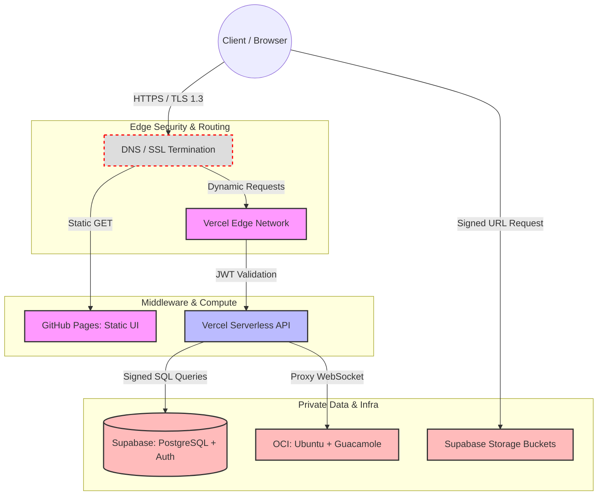

# Technical Requirements Document (TRD)
**Project Name:** Azathoth 
**Document Owner:**  Admin / Developer
**Status:** Draft v1.0

## 1. System Architecture Overview
The Azathoth platform employs a decoupled, serverless-first architecture designed for high availability, zero-maintenance scaling, and strict perimeter security. It leverages edge hosting for static assets, serverless functions for middleware logic, a managed PostgreSQL instance for relational state, and an isolated cloud environment for remote administration.

## 2. Network Flow & Security Boundaries

'''
## 3. Technology Stack & Architectural Decisions

Every component in the stack was selected by weighing performance, maintenance overhead, and security against viable alternatives.

| **Layer**            | **Chosen Technology**         | **Alternatives Rejected**             | **Justification for Choice**                                                                                                                                                    |
| -------------------- | ----------------------------- | ------------------------------------- | ------------------------------------------------------------------------------------------------------------------------------------------------------------------------------- |
| **Frontend Hosting** | **GitHub Pages**              | AWS S3, Netlify                       | Native integration with the repository. Provides free, high-availability static hosting with zero configuration required.                                                       |
| **App / API Logic**  | **Vercel**                    | AWS API Gateway + Lambda, Heroku      | Superior developer experience for serverless deployment. Handles dynamic routing and middleware edge-caching more efficiently than raw AWS Lambda setups.                       |
| **Database**         | **PostgreSQL (via Supabase)** | MongoDB, Firebase (NoSQL)             | The forum and RBAC systems require complex relational mapping. PostgreSQL provides strict schema enforcement and native Row Level Security (RLS) which NoSQL alternatives lack. |
| **Authentication**   | **Supabase Auth (GoTrue)**    | Auth0, Custom JWT logic               | Natively tied to the PostgreSQL database. Allows DB-level rejection of queries if the JWT token is invalid, eliminating a massive middleware attack vector.                     |
| **Object Storage**   | **Supabase Storage**          | AWS S3                                | Keeps infrastructure centralized. Integrates directly with the same auth tokens used for the database, simplifying permission management for the Vault.                         |
| **Remote Gateway**   | **Apache Guacamole**          | Chrome Remote Desktop, Direct SSH/RDP | Provides clientless HTML5 access. Prevents exposing vulnerable ports (22, 3389) to the public internet.                                                                         |
| **Remote Server**    | **Oracle Cloud (OCI) Ubuntu** | AWS EC2, DigitalOcean                 | OCI provides a robust "Always Free" tier (ARM instances) that includes sufficient compute and bandwidth for a personal development server.                                      |

## 4. Security Architecture

Security is enforced at three distinct layers: the Edge, the Application, and the Database.

### 4.1. Data in Transit & Perimeter Defense

- All traffic is strictly enforced over **TLS 1.3**. Unencrypted HTTP requests are automatically upgraded or dropped at the DNS level.
    
- Static assets are served via CDN, mitigating basic DDoS vectors by caching content at the edge.

### 4.2. Access Control & Identity (JWT)

- The system utilizes stateless JSON Web Tokens (JWT) for authentication.
    
- Session tokens are stored in secure, `HttpOnly`, `SameSite=Strict` cookies to prevent Cross-Site Scripting (XSS) payload extraction.
    
- Vercel edge middleware intercepts all requests to `/shared-vault` and `/admin-dashboard` to verify the JWT signature before invoking any compute resources.

### 4.3. Data at Rest & Row Level Security (RLS)

- Storage buckets and database volumes are encrypted at rest using AES-256.
    
- **Row Level Security (RLS):** This is the ultimate fallback. Even if a malicious actor bypasses the Vercel API and attempts to query the database directly, the PostgreSQL engine executes the query against the user's JWT `role_id`. If an "Associate" tries to read an "Admin" file, the database drops the request at the kernel level.
    
- The OCI instance firewall (Security Lists) is configured to drop all incoming TCP connections except those originating from the Vercel Guacamole proxy, completely hiding the server from public IP scanners.

### 4.4. Distributed Denial of Service (DDoS) Mitigation
To protect against both volumetric (Layer 3/4) and application-layer (Layer 7) attacks, mitigation strategies are enforced across all three infrastructure providers.

* **Edge/API Layer (Vercel & GitHub Pages):** * Vercel's Edge Network automatically absorbs volumetric attacks (UDP reflection, SYN floods) and drops malicious packets before they reach the serverless functions.
  * **Rate Limiting:** Vercel middleware enforces strict rate limiting on all `POST` requests (e.g., the Contact Form and Authentication routes) to prevent Layer 7 HTTP flood attacks and credential stuffing.
* **Database Layer (Supabase):**
  * Direct public connection to the PostgreSQL port (5432) is disabled.
  * Connection exhaustion attacks are mitigated using Supabase's built-in connection pooler (Supavisor), which queues and manages active connections rather than allowing concurrent floods to crash the database engine.
  * Statement timeouts are enforced to kill maliciously slow queries designed to lock up database resources.
* **Infrastructure Layer (OCI & Guacamole):**
  * The Oracle Cloud Virtual Cloud Network (VCN) Security Lists are configured to silently drop all external ICMP (Ping) requests and block all inbound TCP/UDP traffic.
  * The only allowed ingress traffic is restricted to the specific IP ranges of the Vercel deployment, making the Guacamole server completely "dark" to public internet scanners and botnets.