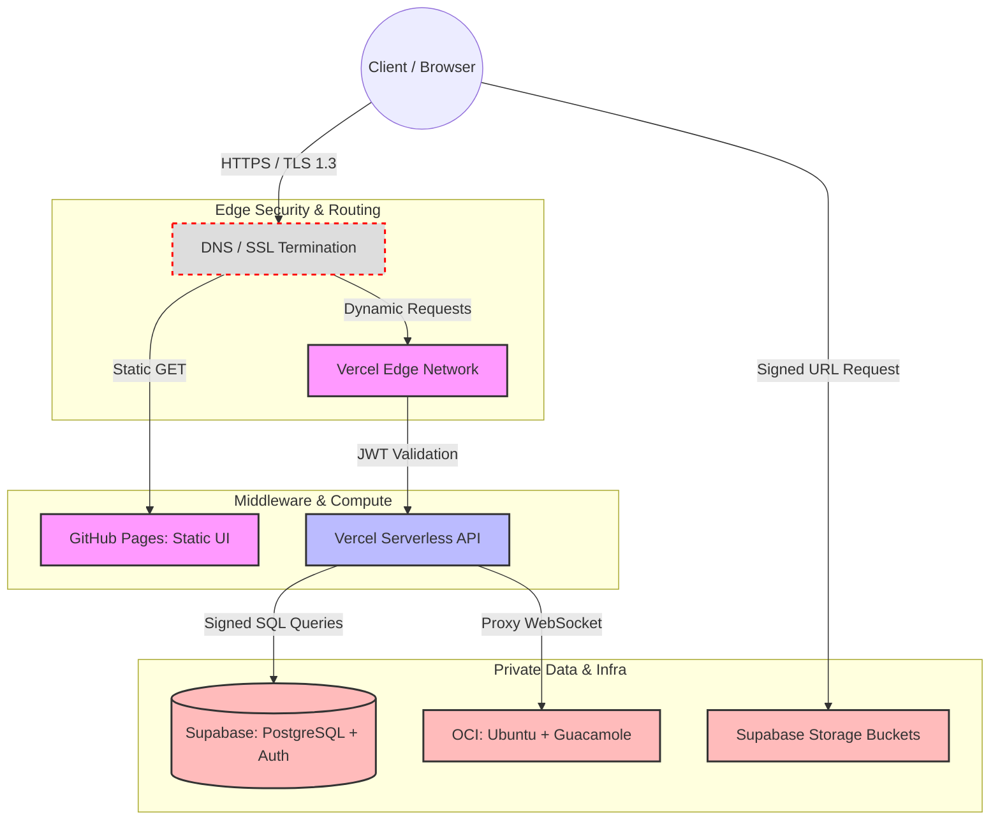

# Technical Requirements Document (TRD)
**Project Name:** Azathoth 
**Document Owner:**  Admin / Developer
**Status:** Draft v1.0

## 1. System Architecture Overview
The Azathoth platform employs a decoupled, serverless-first architecture designed for high availability, zero-maintenance scaling, and strict perimeter security. It leverages edge hosting for static assets, serverless functions for middleware logic, a managed PostgreSQL instance for relational state, and an isolated cloud environment for remote administration.

## 2. Network Flow & Security Boundaries


'''
## 3. Technology Stack & Architectural Decisions

Every component in the stack was selected by weighing performance, maintenance overhead, and security against viable alternatives.

| **Layer**            | **Chosen Technology**         | **Alternatives Rejected**             | **Justification for Choice**                                                                                                                                                    |
| -------------------- | ----------------------------- | ------------------------------------- | ------------------------------------------------------------------------------------------------------------------------------------------------------------------------------- |
| **Frontend Hosting** | **GitHub Pages**              | AWS S3, Netlify                       | Native integration with the repository. Provides free, high-availability static hosting with zero configuration required.                                                       |
| **App / API Logic**  | **Vercel**                    | AWS API Gateway + Lambda, Heroku      | Superior developer experience for serverless deployment. Handles dynamic routing and middleware edge-caching more efficiently than raw AWS Lambda setups.                       |
| **Database**         | **PostgreSQL (via Supabase)** | MongoDB, Firebase (NoSQL)             | The forum and RBAC systems require complex relational mapping. PostgreSQL provides strict schema enforcement and native Row Level Security (RLS) which NoSQL alternatives lack. |
| **Authentication**   | **Supabase Auth (GoTrue)**    | Auth0, Custom JWT logic               | Natively tied to the PostgreSQL database. Allows DB-level rejection of queries if the JWT token is invalid, eliminating a massive middleware attack vector.                     |
| **Object Storage**   | **Supabase Storage**          | AWS S3                                | Keeps infrastructure centralized. Integrates directly with the same auth tokens used for the database, simplifying permission management for the Vault.                         |
| **Remote Gateway**   | **Apache Guacamole**          | Chrome Remote Desktop, Direct SSH/RDP | Provides clientless HTML5 access. Prevents exposing vulnerable ports (22, 3389) to the public internet.                                                                         |
| **Remote Server**    | **Oracle Cloud (OCI) Ubuntu** | AWS EC2, DigitalOcean                 | OCI provides a robust "Always Free" tier (ARM instances) that includes sufficient compute and bandwidth for a personal development server.                                      |

## 4. Security Architecture

Security is enforced at three distinct layers: the Edge, the Application, and the Database.

### 4.1. Data in Transit & Perimeter Defense

- All traffic is strictly enforced over **TLS 1.3**. Unencrypted HTTP requests are automatically upgraded or dropped at the DNS level.
    
- Static assets are served via CDN, mitigating basic DDoS vectors by caching content at the edge.

### 4.2. Access Control & Identity (JWT)

- The system utilizes stateless JSON Web Tokens (JWT) for authentication.
    
- Session tokens are stored in secure, `HttpOnly`, `SameSite=Strict` cookies to prevent Cross-Site Scripting (XSS) payload extraction.
    
- Vercel edge middleware intercepts all requests to `/shared-vault` and `/admin-dashboard` to verify the JWT signature before invoking any compute resources.

### 4.3. Data at Rest & Row Level Security (RLS)

- Storage buckets and database volumes are encrypted at rest using AES-256.
    
- **Row Level Security (RLS):** This is the ultimate fallback. Even if a malicious actor bypasses the Vercel API and attempts to query the database directly, the PostgreSQL engine executes the query against the user's JWT `role_id`. If an "Associate" tries to read an "Admin" file, the database drops the request at the kernel level.
    
- The OCI instance firewall (Security Lists) is configured to drop all incoming TCP connections except those originating from the Vercel Guacamole proxy, completely hiding the server from public IP scanners.

### 4.4. Distributed Denial of Service (DDoS) Mitigation
To protect against both volumetric (Layer 3/4) and application-layer (Layer 7) attacks, mitigation strategies are enforced across all three infrastructure providers.

* **Edge/API Layer (Vercel & GitHub Pages):** * Vercel's Edge Network automatically absorbs volumetric attacks (UDP reflection, SYN floods) and drops malicious packets before they reach the serverless functions.
  * **Rate Limiting:** Vercel middleware enforces strict rate limiting on all `POST` requests (e.g., the Contact Form and Authentication routes) to prevent Layer 7 HTTP flood attacks and credential stuffing.
* **Database Layer (Supabase):**
  * Direct public connection to the PostgreSQL port (5432) is disabled.
  * Connection exhaustion attacks are mitigated using Supabase's built-in connection pooler (Supavisor), which queues and manages active connections rather than allowing concurrent floods to crash the database engine.
  * Statement timeouts are enforced to kill maliciously slow queries designed to lock up database resources.
* **Infrastructure Layer (OCI & Guacamole):**
  * The Oracle Cloud Virtual Cloud Network (VCN) Security Lists are configured to silently drop all external ICMP (Ping) requests and block all inbound TCP/UDP traffic.
  * The only allowed ingress traffic is restricted to the specific IP ranges of the Vercel deployment, making the Guacamole server completely "dark" to public internet scanners and botnets.

## 5. Database Schema & Data Architecture

The database is built on PostgreSQL. To guarantee atomicity and handle bulk data efficiently, the schema strictly avoids JSONB blobs for relational data, enforces foreign key constraints to prevent orphaned records, and utilizes B-Tree indexing on all query-heavy columns.

### 5.1. Core Tables & Normalization

#### Table: `profiles`
Maps to the hidden Supabase `auth.users` system table. Stores public and RBAC data.
| Column | Type | Constraints | Description |
| :--- | :--- | :--- | :--- |
| `id` | `uuid` | PK, FK (`auth.users.id`) CASCADE | Primary identifier. |
| `role` | `varchar(20)` | NOT NULL, DEFAULT 'public' | Enforces RBAC (`public`, `associate`, `admin`). |
| `display_name` | `varchar(50)` | NOT NULL | Publicly visible name for forum posts. |
| `created_at` | `timestamptz` | NOT NULL, DEFAULT `now()` | Timezone-aware creation timestamp. |

#### Table: `forum_posts`
Stores all community discussions. Normalized to ensure rapid bulk querying without duplicating user data.
| Column | Type | Constraints | Description |
| :--- | :--- | :--- | :--- |
| `id` | `uuid` | PK, DEFAULT `uuid_generate_v4()` | Unique post identifier. |
| `author_id` | `uuid` | FK (`profiles.id`) SET NULL | Links post to author. Becomes NULL if user deleted. |
| `title` | `varchar(150)` | NOT NULL | Post header. |
| `body` | `text` | NOT NULL | Sanitized Markdown/text payload. |
| `is_archived` | `boolean` | DEFAULT `false` | Soft-delete flag. Preserves data atomicity. |
| `created_at` | `timestamptz`| NOT NULL, DEFAULT `now()` | Timestamp of post. |

*Index Strategy:* B-Tree index on `created_at` (DESC) and `author_id` to handle bulk loading on the forum frontend.

#### Table: `vault_metadata`
Stores metadata for files hosted in Supabase Storage. Separating metadata from physical storage ensures the database remains highly performant during bulk file operations.
| Column | Type | Constraints | Description |
| :--- | :--- | :--- | :--- |
| `id` | `uuid` | PK, DEFAULT `uuid_generate_v4()` | Unique file identifier. |
| `storage_path` | `text` | NOT NULL, UNIQUE | Exact path in the Supabase Storage bucket. |
| `file_name` | `varchar(255)` | NOT NULL | Human-readable name. |
| `access_tier`| `varchar(20)` | NOT NULL | Defines who can read it (`associate`, `admin`). |
| `size_bytes` | `bigint` | NOT NULL | Used for storage quota calculations. |

#### Table: `audit_logs`
An append-only ledger tracking all authentication and data-modification events. Crucial for system governance.
| Column | Type | Constraints | Description |
| :--- | :--- | :--- | :--- |
| `log_id` | `bigserial` | PK | Sequential integer for rapid bulk inserts. |
| `actor_id` | `uuid` | FK (`profiles.id`) | Who triggered the event (can be null for system). |
| `action` | `varchar(50)` | NOT NULL | e.g., `LOGIN_FAILED`, `FILE_DELETED`, `POST_CREATED`. |
| `ip_address` | `inet` | NULL | IPv4/IPv6 address of the actor. |
| `timestamp` | `timestamptz`| NOT NULL, DEFAULT `now()` | Exact time of the event. |

*Edge Case Mitigation:* If the system generates millions of logs, this table will be partitioned by month (`PARTITION BY RANGE (timestamp)`) to maintain query speed and allow for bulk archival of old logs.

### 5.2. Row Level Security (RLS) Policies

To prevent unauthorized bulk scraping or data manipulation, security is enforced at the database kernel level using RLS. Even if an API endpoint is compromised, the database will reject the query.

* **`profiles` Table:**
  * *Read:* `TRUE` (Everyone can read display names for the forum).
  * *Update:* `auth.uid() = id` (Users can only update their own display name) OR `auth.jwt() ->> 'role' = 'admin'`.
* **`forum_posts` Table:**
  * *Read:* `is_archived = false` (Public can read active posts).
  * *Insert:* `auth.uid() IS NOT NULL` (Must be authenticated).
  * *Update/Delete:* `auth.uid() = author_id` OR `auth.jwt() ->> 'role' = 'admin'`.
* **`vault_metadata` & Storage Buckets:**
  * *Read (Associates):* `auth.jwt() ->> 'role' IN ('associate', 'admin') AND access_tier = 'associate'`.
  * *Read (Admin):* `auth.jwt() ->> 'role' = 'admin'`.
  * *Write/Delete:* `auth.jwt() ->> 'role' = 'admin'` (Only Admin can modify the vault).
* **`audit_logs` Table:**
  * *Read:* `auth.jwt() ->> 'role' = 'admin'` (Strictly Admin only).
  * *Insert:* Executed via PostgreSQL Triggers with `SECURITY DEFINER` privileges. Users cannot manually insert or modify logs.
  * *Update/Delete:* `FALSE` (Immutable table).

### 5.3. Edge Case Handling & Data Integrity
1. **Orphaned Data:** If a user account is deleted, their `forum_posts` are retained but `author_id` is set to `NULL` (via `ON DELETE SET NULL`), preserving the community thread context without violating foreign key constraints. 
2. **Concurrent Bulk Writes:** The system uses transaction blocks (`BEGIN` ... `COMMIT`) when handling multi-table operations (e.g., uploading a file to storage AND writing to `vault_metadata`). If the storage upload fails, the database write automatically rolls back, maintaining perfect atomicity.
3. **Pagination & Load Limits:** All `SELECT` queries against `forum_posts` and `audit_logs` are strictly paginated using `LIMIT` and `OFFSET` to prevent Out Of Memory (OOM) errors during bulk retrieval.

### 5.4. Threat Mitigation & Database Defence

To maintain strict governance and protect against common web vulnerabilities (OWASP Top 10), the database and API layers enforce the following defensive protocols:

* **SQL Injection (SQLi) Prevention:** The system utilizes PostgREST for all database interactions. All API requests are automatically translated into parameterized queries (prepared statements). User input is never concatenated directly into executable SQL strings, rendering standard injection attacks mathematically impossible at the application layer.
* **Insecure Direct Object Reference (IDOR) Prevention:** Resource IDs (UUIDs) are decoupled from access rights. Row Level Security (RLS) acts as a strict gatekeeper. Even if an attacker discovers the UUID of a restricted `vault_metadata` record, the PostgreSQL kernel will return a `404 Not Found` equivalent if the requester's JWT `role` does not match the required `access_tier`.
* **Cross-Site Scripting (XSS) Mitigation:** All inputs targeting the `forum_posts` and `inquiries` tables undergo strict server-side sanitization to strip executable `<script>` tags and malicious HTML attributes before the `INSERT` transaction is committed.
* **Cross-Site Request Forgery (CSRF) Mitigation:** Authentication state is managed via secure, `HttpOnly` cookies strictly bound to the `adarshsadanand.in` domain utilizing the `SameSite=Strict` attribute, preventing unauthorized cross-origin requests from utilizing an active session.

### 5.5. Availability, Maintenance & GRC Protocols

To ensure continuous operation and compliance with standard data privacy frameworks, the database layer enforces strict lifecycle and availability controls.

* **High Availability & Disaster Recovery (DR):** The PostgreSQL database utilizes Write-Ahead Logging (WAL) to enable Point-in-Time Recovery (PITR). Automated physical backups are executed daily by the infrastructure provider, ensuring a strict Recovery Point Objective (RPO) of 24 hours in the event of catastrophic data corruption.

* **Automated Log Rotation:** To prevent storage exhaustion and maintain query performance, system audit logs are subjected to automated lifecycle management. A `pg_cron` background worker executes a monthly clean-up script, archiving or permanently dropping records in the `audit_logs` table that exceed a 365-day retention period.

* **PII Sanitization & The Right to be Forgotten (RTBF):** The schema is designed to respect user privacy while maintaining referential integrity. When an authenticated Associate requests account deletion, a cascading database function is triggered. This function permanently purges the user's Personally Identifiable Information (PII) from the `profiles` table. Associated relational records, such as `forum_posts`, are retained to preserve community thread context, but their `author_id` is irreversibly nullified, rendering the data fully anonymized.

## 6. API Architecture & Middleware

The application utilizes a bifurcated API strategy. Standard CRUD operations leverage the Supabase PostgREST client for low-latency, RLS-secured database interactions. Complex business logic, secure proxying, and edge routing are handled by Vercel Serverless Functions.

### 6.1. Vercel Serverless Endpoints (Custom Logic)

These endpoints execute in secure Node.js environments. They are protected by Vercel's Edge rate-limiting and handle operations requiring secure secrets not exposed to the client.

#### 1. Inbound Communications
* **Endpoint:** `POST /api/contact`
* **Purpose:** Receives payload from the public Portfolio "Contact Me" form, sanitizes the input, and executes a service-role insertion into the `inquiries` table.
* **Payload Structure:**
  ```json
  {
    "name": "string (max 100)",
    "email": "string (valid email format)",
    "message": "string (max 1000)"
  }
  ```
- **Response Codes:**
    - `200 OK`: Message accepted and stored.
    - `429 Too Many Requests`: Rate limit exceeded (mitigates spam).
    - `400 Bad Request`: Malformed email or missing fields.

#### 2. Remote Gateway Proxy (Guacamole)

- **Endpoint:** `GET /api/gateway/connect`
- **Purpose:** Establishes a secure WebSocket/HTTP tunnel to the OCI Ubuntu instance.
- **Security:** This endpoint mandates a valid Admin JWT. The Vercel function acts as a reverse proxy, translating the browser's HTML5 canvas commands into the Guacamole protocol, ensuring the OCI server's IP is never exposed to the client.
- **Response:** Upgrades connection to WebSocket (101 Switching Protocols) or returns `403 Forbidden`.

### 6.2. Edge Middleware & Routing Security

Vercel Edge Middleware (`middleware.ts`) intercepts all incoming HTTP requests _before_ they hit the serverless functions or static pages. It acts as the platform's traffic cop.

- **Execution Flow:**
    1. Request arrives at `adarshsadanand.in/*`.
    2. Middleware checks the requested path.
    3. If the path is public (e.g., `/`, `/forum`, `/resume`), the request passes through immediately.
    4. If the path is restricted (e.g., `/shared-vault`, `/admin-dashboard`), the middleware inspects the `sb-access-token` HTTP cookie.
    5. The middleware cryptographically verifies the JWT signature.
    6. If valid, it reads the `role_id`. If authorized, the request proceeds. If unauthorized or missing, the user is immediately redirected with a `302 Found` to `/login`.

- **Performance Impact:** Edge execution occurs globally at the CDN node closest to the user, resulting in sub-50ms latency for auth rejections, protecting downstream compute resources.

### 6.3. Supabase PostgREST Endpoints (Data Layer)

The frontend React/Vanilla JS application interacts directly with Supabase for standard state management, completely bypassing Vercel compute to reduce costs and latency.

- **`GET /rest/v1/forum_posts`:** Fetches active community threads. Appends `?limit=20&offset=0` for pagination. RLS ensures only `is_archived=false` records are returned.
- **`POST /rest/v1/forum_posts`:** Client submits a new thread. The JWT is automatically passed in the `Authorization: Bearer <token>` header. The PostgreSQL database validates the token via RLS before committing the insert.

## 7. Infrastructure, Deployment & CI/CD

The deployment pipeline relies on strict separation of concerns to prevent secret leakage and ensure continuous availability across the decoupled stack.

### 7.1. CI/CD Pipeline & Secret Management
* **Frontend Build (GitHub Actions):** Pushes to the `main` branch trigger a static build process deployed to GitHub Pages.
  * *Constraint Mitigation (Secret Leakage):* The GitHub environment is strictly injected with the Supabase `anon` key. The `service_role` key is explicitly banned from the GitHub repository secrets to prevent accidental bundling into the public HTML.
* **Backend Build (Vercel):** Pushes to the `main` branch trigger serverless function deployment.
  * *Constraint Mitigation (CORS):* Vercel's `next.config.js` enforces strict Cross-Origin Resource Sharing (CORS), hard-dropping any `POST` or `GET` API requests that do not originate from `https://adarshsadanand.in`.

### 7.2. Frontend Routing & State Management
* **Routing Hack (SPA 404 Prevention):** Because GitHub Pages does not natively support Single Page Application (SPA) dynamic routing, a custom `404.html` script intercepts unmapped route requests (e.g., a direct link to `/admin-dashboard`), stores the requested path in `sessionStorage`, and redirects to the `index.html` root where the client-side router restores the intended view.
* **Session State (Silent JWT Refresh):** To prevent data loss during long sessions (e.g., writing a blog post), the frontend implements Supabase's `onAuthStateChange`. A background worker silently requests a fresh JWT 5 minutes before expiry, ensuring authorized database transactions are not rejected due to timeouts.

## 7. Infrastructure, Deployment & CI/CD Protocols

The deployment architecture enforces absolute decoupling of the static presentation layer from the dynamic execution environment. Pipeline orchestration is governed by strict environment variable isolation.

### 7.1. CI/CD Pipeline & Cryptographic Secret Management
* **Frontend Build Pipeline (GitHub Actions):** * Triggered on `push` to `refs/heads/main`.
  * Executes standard `npm run lint` and `npm run build` routines.
  * **Secret Isolation Matrix:** The build environment is injected exclusively with `NEXT_PUBLIC_SUPABASE_URL` and `NEXT_PUBLIC_SUPABASE_ANON_KEY`. The `SUPABASE_SERVICE_ROLE_KEY` is explicitly omitted from the repository's CI context to prevent static bundle contamination.
* **Backend Build Pipeline (Vercel):**
  * Evaluates serverless functions against the Node.js 18.x runtime environment.
  * **CORS Preflight Configuration:** The `next.config.js` and edge middleware enforce strict Cross-Origin Resource Sharing rules. All Vercel endpoints explicitly return the following headers, dropping unauthorized cross-origin requests at the Edge:
    ```http
    Access-Control-Allow-Origin: [https://adarshsadanand.in](https://adarshsadanand.in)
    Access-Control-Allow-Methods: GET, POST, OPTIONS
    Access-Control-Allow-Headers: Authorization, Content-Type, sb-access-token
    ```

### 7.2. Frontend Routing State & Token Lifecycle
* **SPA 404 Interception (GitHub Pages):** GitHub Pages lacks native rewrite capabilities for Single Page Applications. A custom `404.html` acts as a proxy script. It captures `window.location.pathname`, serializes it into `sessionStorage`, and executes a `window.location.replace('/')`. The `index.html` root intercepts this payload and dynamically updates the DOM history tree via `window.history.replaceState()`.
* **JWT Lifecycle Worker:** Authentication relies on short-lived stateless JWTs (3600-second TTL). The client implements a background worker bound to the `supabase.auth.onAuthStateChange` listener. At $T-300$ seconds (5 minutes prior to token expiration), the worker issues an asynchronous `POST /auth/v1/token?grant_type=refresh_token` request to ensure uninterrupted `INSERT`/`UPDATE` capabilities during long-lived DOM sessions (e.g., editing the Private Blog).

## 8. Remote Gateway & OCI Infrastructure Tunnelling

The remote gateway architecture circumvents standard serverless TCP constraints by utilizing a decoupled WebSocket reverse proxy strategy, ensuring low-latency RDP/SSH translation for development workloads.

### 8.1. Guacamole Daemon & Reverse Proxy Topography
* **Constraint:** Vercel Serverless Functions enforce a hard execution timeout (10s–60s) and cannot sustain the persistent bidirectional WebSocket stream required by the `guacd` (Guacamole proxy daemon).
* **Network Implementation:** * The Vercel API (`/api/gateway/connect`) is restricted solely to JWT validation and issuing a one-time cryptographic handshake.
  * The OCI Ubuntu instance operates the `guacd` service locally.
  * A `cloudflared` daemon (Cloudflare Tunnel) is installed on the OCI instance, establishing an outbound-only HTTPS tunnel to the Cloudflare edge network.
  * The client browser establishes a direct `Upgrade: websocket` connection via the tunnel, completely bypassing Vercel compute.

### 8.2. Infrastructure Retention & Egress Throttling
* **OCI "Always Free" Synthetic Load Generator:** To prevent Oracle Cloud Infrastructure from classifying the ARM Ampere A1 instance as "idle" (triggering forced reclamation at <10% utilization), a local `cron` job executes a synthetic CPU load. 
  * *Execution:* `0 2 * * * /usr/bin/stress-ng --cpu 2 --timeout 300s` (Forces 5 minutes of multi-core load daily).
* **Cold Start Prevention:** A GitHub Action `cron` worker executes a synthetic `GET` request to the API gateway and a `SELECT 1` query to Supabase every 12 hours, ensuring the compute instances and database connection pools remain resident in memory.
* **Egress Rate Limiting:** The Guacamole connection daemon is configured with a strict `client-timeout=900` (15 minutes). The Supabase Storage buckets enforce an `upload_size_limit` of 52428800 bytes (50MB) via RLS configurations to prevent outbound bandwidth exhaustion.

## 9. Database Connection Pooling Topology

* **Constraint:** Serverless environments exhibit high horizontal concurrency. Direct TCP connections to PostgreSQL (Port 5432) will cause connection queue exhaustion (OOM/Lockup) under load.
* **Implementation:** The architecture utilizes **Supavisor** (a scalable connection pooler written in Elixir) operating in **Transaction Mode**. 
  * Vercel functions must explicitly target port `6543` (the IPv4 pooler port) rather than the direct database engine.
  * Transaction mode ensures that a database connection is acquired only for the duration of a single `BEGIN ... COMMIT` block, returning immediately to the pool. This allows 15 active database connections to safely multiplex over 1,000 concurrent serverless function invocations.